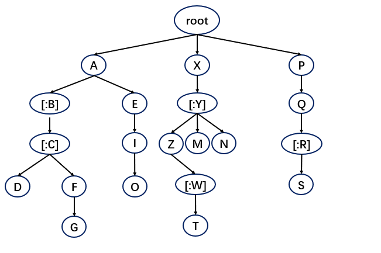

## ScpiParseTree
这个类用于注册和调用SCPI指令对应的函数

这里是两个目标函数用于测试
```c++
static void func1(){std::cerr<<__PRETTY_FUNCTION__<<std::endl;}

static int func2(){std::cerr<<__PRETTY_FUNCTION__<<std::endl;}

double add(int a,double b)
{
    std::cout<<__PRETTY_FUNCTION__<<a<<" "<<b<<std::endl<<std::flush;
    return a + b;
}

class Object
{
public:
    void func(){std::cerr<<__PRETTY_FUNCTION__<<std::endl;}
    
    double subtract(double a,int b)
    {
        std::cout<<__PRETTY_FUNCTION__<<a<<" "<<b<<std::endl<<std::flush;
        return a - b;
    }
};
```

## 一：关于类ScpiParseTree的成员函数和使用方法介绍
ScpiParseTree作为暴露给其他用户直接使用的接口仅仅提供了两个必要的接口,一个是注册SCPI指令的注册接口,一个是解析和执行SCPI指令对应函数的执行接口,他们的定义和使用方法如下:<br />
### 1.绑定SCPI指令和目标函数
```c++
template <typename SetFunc,typename GetFunc,typename Obj>
registeScpi(const std::string& scpi,SetFunc setFunc,GetFunc getFunc,Obj* obj)//注册成员函数为SCPI指令调用

template <typename SetFunc,typename GetFunc>
registeScpi(const std::string& scpi,SetFunc setFunc,GetFunc getFunc)//注册自由函数为SCPI指令调用
```
有一些指令既可以设置参数也可以用来读取参数,但是有一些参数只能用来读取或者设置,对于不存在的目标函数,直接传递空指针即可
```c++
ScpiParseTree tree;
tree.registeScpi("A[:B][:C]:D", func1, nullptr);//将自由函数func1作为设置函数绑定到A:B[:C]:D
tree.registeScpi("X[:Y]:Z[:W]:T", nullptr, func2); //将自由函数func2作为查询函数绑定到X[:Y]:Z[:W]:T
tree.registeScpi("G[:H]:I:J", &Object::func, nullptr,&obj); //将成员函数Object::func作为设置函数绑定到G[:H]:I:J
```
### 2.解析SCPI指令并调用目标函数
```c++
std::string excute(const std::string& scpi)
```
直接将接收到的SCPI字符串传递给excute函数即可完成对应函数的调用<br />
```c++
tree.excute("A:D");             // 全部省略
tree.excute("A:B:D");           // 包含B
tree.excute("A:C:D");           // 包含C
tree.excute("A:B:C:D");         // 全部包含
```

### 注:以上接口就是业务开发者需要用到的全部接口,关于原始指令的注册、输入指令的查找和匹配,函数参数的解析和调用这部分内容会在后续的文档中进行详细说明，这些内容都属于解析树的内部实现，非解析树开发或维护人员无需关心这些具体的细节。
### 以下为解析树内部实现原理和接口说明

## 二.关于类ScpiParseNode的成员函数和内部原理说明
ScpiParseNode是解析树的核心数据结构,每一条原始SCPI指令都可以拆分为若干条子命令,每一条子命令都有一个对应的ScpiParseNode节点,由一个root节点和若干个ScpiParseNode构成一颗完整的SCPI解析树,每一条原始SCPI指令都对应着一条从root节点触发的唯一的分支。<br />
假设存在以下几条原始SCPI指令:
```txt
A[:B][:C]:D
A[:B][:C]:F:G
A:E:I:O
X[:Y]:Z[:W]:T
X[:Y]:M
X[:Y]:N
P:Q[:R]:S
```
对应的解析树为:<br />
<br />

## ScpiParseNode成员变量说明
```c++
class ScpiParseNode
{
    std::string nodeCommand;//当前节点对应的原始指令
    std::list<ScpiParseNode*> allDirectNodes;//全部直接子节点
    std::list<ScpiParseNode*> omissibleNodes;//全部直接子节点中可省略节点的集合
    FunctionWrapper* setFunc = nullptr;//当前指令对应的设置函数
    FunctionWrapper* getFunc = nullptr;//当前指令对应的查询函数
    bool existOmissibleBranch = false;//当前节点是否存在完全可省略的子分支
}
```
### 1.构造函数
```c++
ScpiParseNode();//构造一个空节点

ScpiParseNode(const std::string& regCmd,FunctionWrapper* setter,FunctionWrapper* getter);//构造一个包含对应函数指针的节点
//三个参数分别为:当前节点的原始指令(按原始指令分割出来的子命令，包含'[' '<'等符号)、设置函数、查询函数。
//当且仅当当前节点是最后一级节点时,才给setter和getter赋值对应的函数包装器指针,否则赋值空指针,确保只有最后一个节点能完成函数调用
```

### 2.注册函数
```c++
void addScpiNode(std::vector<std::string>& regCmdVec,FunctionWrapper* setter,FunctionWrapper* getter);
//这是一个递归函数,第一个参数为原始SCPI指令被分割为若干条子命令的数组,数组每一个元素都对应一个节点
//每一个节点在执行这个函数时都会先判断是否存在同名节点,如果不存在同名节点则创建一个新节点并将新节点添加到当前节点的子节点中,否则直接使用已存在的同名节点
//随后从数组移除当前节点对应的子命令,让同名节点递归执行这个函数,查找下一条子命令对应的节点,直到所有子命令都有一个对应的节点。

///特殊点: 这个函数内部还处理了冲突分支:同一个节点下不能存在一条以上可全部省略的分支,即类似于A:B[:C][:D]和A:B[:E][:F][:G]是不可能同时存在的,B节点内部存在两条可完全省略的分支,这会导致输入A:B的时候程序无法判断这条指令要调用的是哪一个分支。因此需要在程序初始化的时候就避免这种情况,处理逻辑和流程如下:
//1.原始SCPI指令在被切割为若干条子命令时,切割函数内部会对切割结果进行一次逆向遍历,查找是否存在最后N个可以连续省略的节点,如果存在可以连续省略的节点,则将这些节点保存到一个全局数组Set中(切割函数所在的文件内部)。
//2.在开始调用addScpiNode创建节点时,会判断新的子节点节点对应的子命令是否存在于Set数组中,如果存在,则将这当前节点的[存在可省略分支]属性标记为true,否则保持默认状态false。
//3.如果在将当前节点[存在可省略分支]属性标记为true之前这个节点的[存在可省略分支]属性已经为true，说明已经存在一条[可省略分支]，现在添加的是一条新的可省略分支，直接终止程序，需要修改原始SCPI指令才能避免调用时的歧义。
```

### 3.解析函数
```c++
FunctionWrapper* parse(const std::vector<std::string>& cmds);
//这是一个递归函数,处理用户输入的scpi指令,这个函数的参数为字符串向量数组的原因是:在ScpiParseTree::excute函数中调用了输入SCPI指令的处理函数(会在后续文档中进行介绍)将用户输入的scpi指令拆分为两部分:指令部分和参数部分,指令部分就是这里的cmds数组。
//这个函数按照cmds数组中指令的顺序查找目标节点，如果查找到目标节点则返回这个目标节点对应的函数，否则返回空指针表示查找失败。
```
***节点的查找是SCPI解析树最重要最核心的功能,由于存在可省略节点,因此查找过程分为两个查找阶段：1.不可省略的直接子节点查找 2.可省略的子节点递归查找<br />***
**阶段1:<br />**
首先从当前节点的全部 【直接子节点】 进行一次遍历,如果没有匹配到当前输入子命令对应节点，则表明存在两种可能：一种是对应的节点确实不存在，另一种则是可能存在但是这个节点被省略了，所以还需要进行后续两个阶段查找。<br />
**阶段2:<br />**
这一步实际上在阶段1和阶段3的遍历中都会做,但是由于这个过程的代码是在阶段1的函数中编写的，所以把它放在阶段2来说明。遍历当前节点的全部【直接子节点】查找失败之后，需要考虑这些子节点内部是否存在一条完全可省略的分支，如果当前查找的节点对应的输入指令也恰好是最后一级不存在后续子命令了，则说明有可能是因为用户没有输入后续的可省略指令，此时需要对节点判断是否存在可省略分支，如果存在可省略分支，则直接找到这条分支的最后一个节点并返回这个末端节点(由于可省略分支存在唯一性，所以这个末端节点一定是正确的)，否则返回当前节点(这是无所谓的，只有末端节点中保存了要调用的函数指针，返回非末端节点不会对程序造成仍和影响，因为非末端节点根本无法完成函数调用)。
**阶段3:<br />**
对当前节点的全部 【可省略子节点的子节点(也就是当前节点的孙节点)】 进行遍历,假设当前节点所处层位为N,当前节点的子节点所处层数为N+1层，则需要对【属于可省略节点的子节点】第N+2层的全部节点进行遍历，如果第N+2层没有查找到对应的节点，就还需要继续对第N+2层的【可省略节点】的全部子节点(N+3层)进行查找，直到所有【可省略节点的子节点】全部查找完毕。由于节点可省略也可以不省略，因此不能只查找N层以下的【可省略节点的子可省略节点】而是要查找每一层【可省略节点的子节点】。<br />
**阶段4:<br />**
查找到对应的节点之后,根据指令类型返回读取函数指针或者设置函数指针，至此查找完毕。
具体查找流程参考pic/ppt

## ScpiStringHelp文件说明

